# AWS 3-Tier Web Application

> A fully deployed, production-style web application on AWS — provisioned entirely with Terraform, secured with defense-in-depth networking, and delivered with an automated CI/CD pipeline. Zero console clicks.


**[Live Demo](http://three-tier-alb-313594929.eu-central-1.elb.amazonaws.com)** · Infrastructure may be paused to save costs — deploy your own copy in under 10 minutes using the instructions below.

---

## What this project demonstrates

This isn't a tutorial follow-along. Every design decision here was made deliberately:

- **Real network isolation** — EC2 instances live in private subnets with no public IPs. The only entry point is the ALB. The database has no public endpoint at all.
- **Security group chaining** — firewall rules reference other security groups, not IP ranges. The chain is: internet → ALB → EC2 → RDS. Breaking into one tier doesn't give you access to the next.
- **Actual high availability** — two EC2 instances across two Availability Zones. Refresh the live demo and watch the hostname change between `10.0.11.x` and `10.0.12.x`.
- **Infrastructure as Code** — every resource is in Terraform. `terraform apply` builds the entire stack from scratch. `terraform destroy` tears it all down. Nothing exists outside of code.
- **Working CI/CD** — every push to the `terraform/` folder triggers GitHub Actions: format check → init → validate → plan. All against the real AWS account using secrets-injected credentials.

---

## Tech stack

| Layer | Technology |
|---|---|
| Infrastructure as Code | Terraform 1.x |
| Cloud | AWS · eu-central-1 (Frankfurt) |
| CI/CD | GitHub Actions |
| Compute | EC2 t3.micro · Auto Scaling Group (min 2, max 4) |
| Load balancing | AWS Application Load Balancer |
| Application | PHP 8 on Apache · Amazon Linux 2023 |
| Database | RDS MySQL 8.0 · db.t3.micro |

---

## Architecture
```
Internet users
│
▼
Application Load Balancer        ← public subnets  10.0.1.0/24 · 10.0.2.0/24
│
▼
EC2 Auto Scaling Group           ← private subnets  10.0.11.0/24 · 10.0.12.0/24
│
▼
RDS MySQL 8.0                    ← isolated subnets  10.0.21.0/24 · 10.0.22.0/24
```

Six subnets across two AZs inside a `10.0.0.0/16` VPC. Public subnets route to an Internet Gateway. Private subnets route outbound through a NAT Gateway — EC2 can pull updates, but nothing can reach EC2 directly from the internet.

### Security group chain

| Group | Allows inbound | From |
|---|---|---|
| `three-tier-alb-sg` | 80, 443 | `0.0.0.0/0` |
| `three-tier-ec2-sg` | 80 | `three-tier-alb-sg` only |
| `three-tier-rds-sg` | 3306 | `three-tier-ec2-sg` only |
| `three-tier-bastion-sg` | 22 | `0.0.0.0/0` |

---

## Deployment evidence

Every screenshot below is from a real deployment — not mocked, not edited.

### VPC and networking — 18 resources in 2 minutes

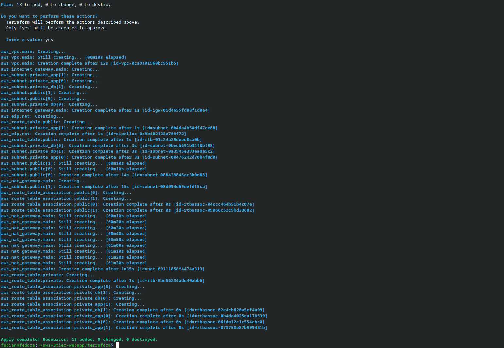

The NAT Gateway took 1m35s alone. Everything else was under 15 seconds. AWS console confirmation below — VPC, subnets, route tables, Internet Gateway, NAT Gateway, and Elastic IP all live.

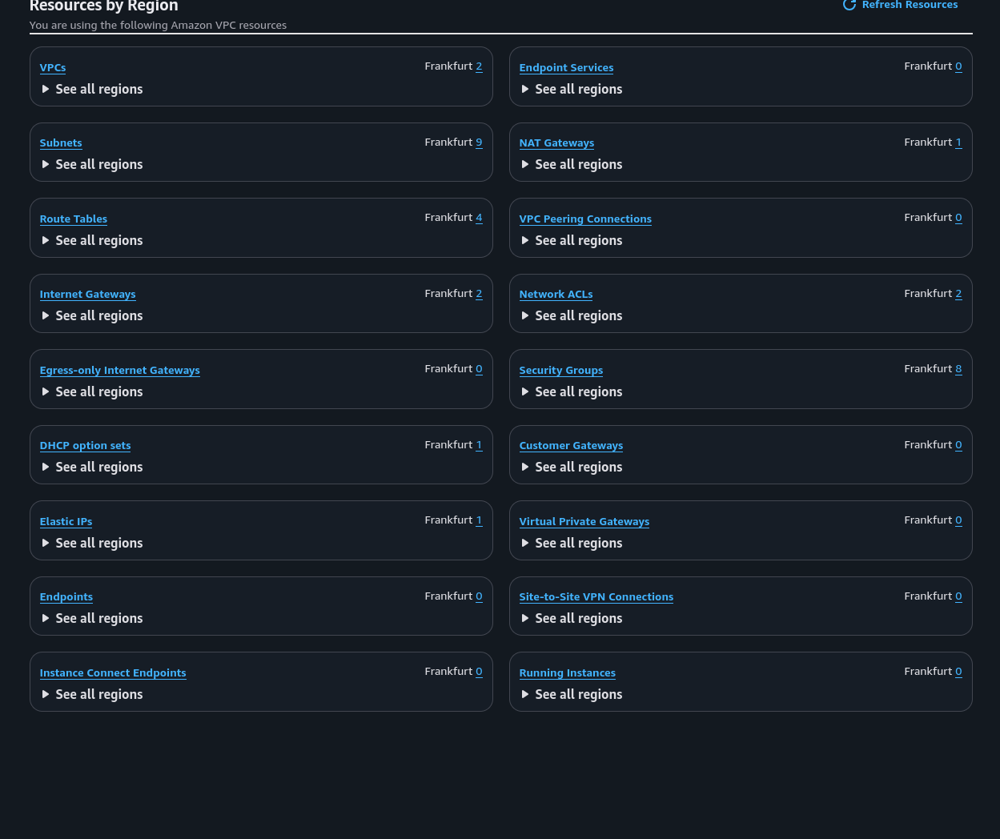

### VPCs

`three-tier-vpc` at `10.0.0.0/16` sitting alongside the default AWS VPC.

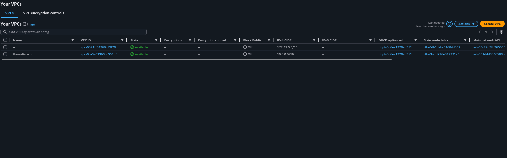

### Subnets — 6 across 2 AZs

Public subnets for the ALB, private app subnets for EC2, private DB subnets for RDS — each pair split across `eu-central-1a` and `eu-central-1b`.

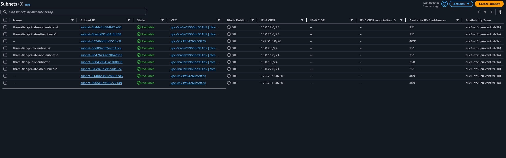

### Route tables

`three-tier-public-rt` → Internet Gateway. `three-tier-private-rt` → NAT Gateway. Two subnets on the public table, four on the private.

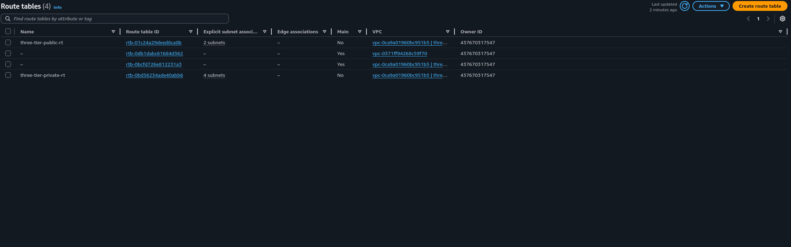

### Security groups — 4 enforcing the tier chain

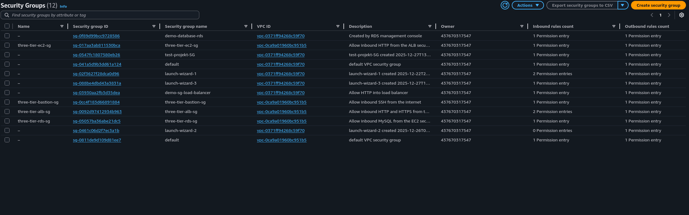

### RDS — available after 5m06s

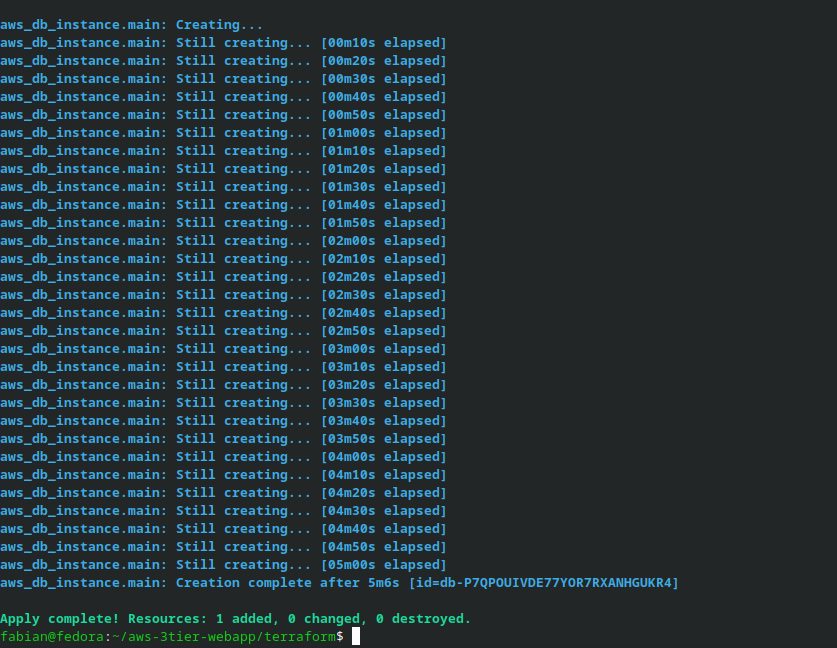

MySQL 8.0 on `db.t3.micro`, no public endpoint, inside the VPC. Status: Available.

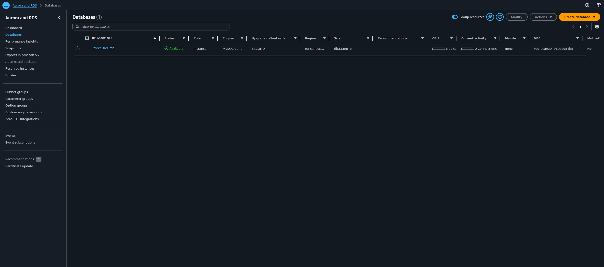

### EC2, ALB, and ASG — 8 resources, ALB live in 2m22s

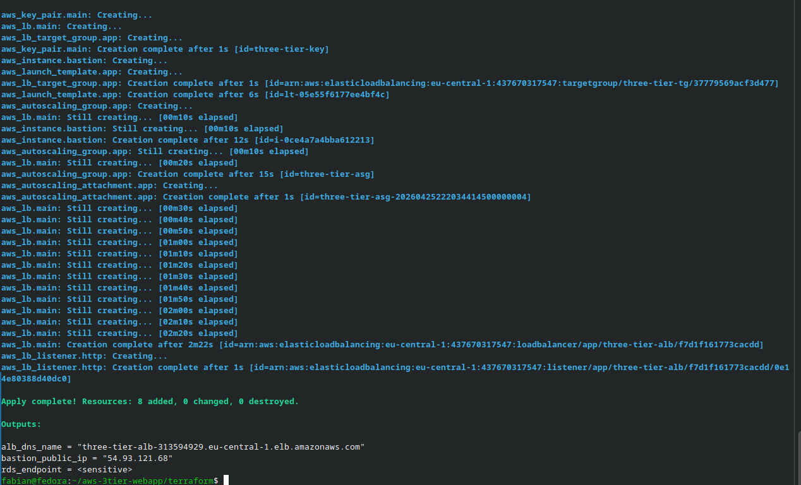

Three instances running — 2 app servers from the ASG, 1 bastion host. All 3/3 status checks passed.

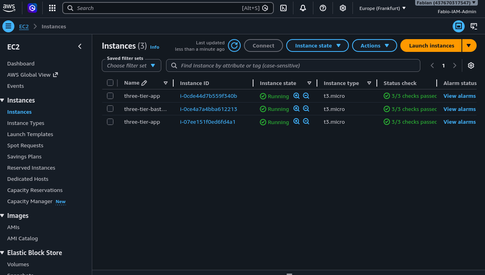

### Both instances healthy in the target group

One instance in `eu-central-1a`, one in `eu-central-1b`. Zero unhealthy. Zero draining.

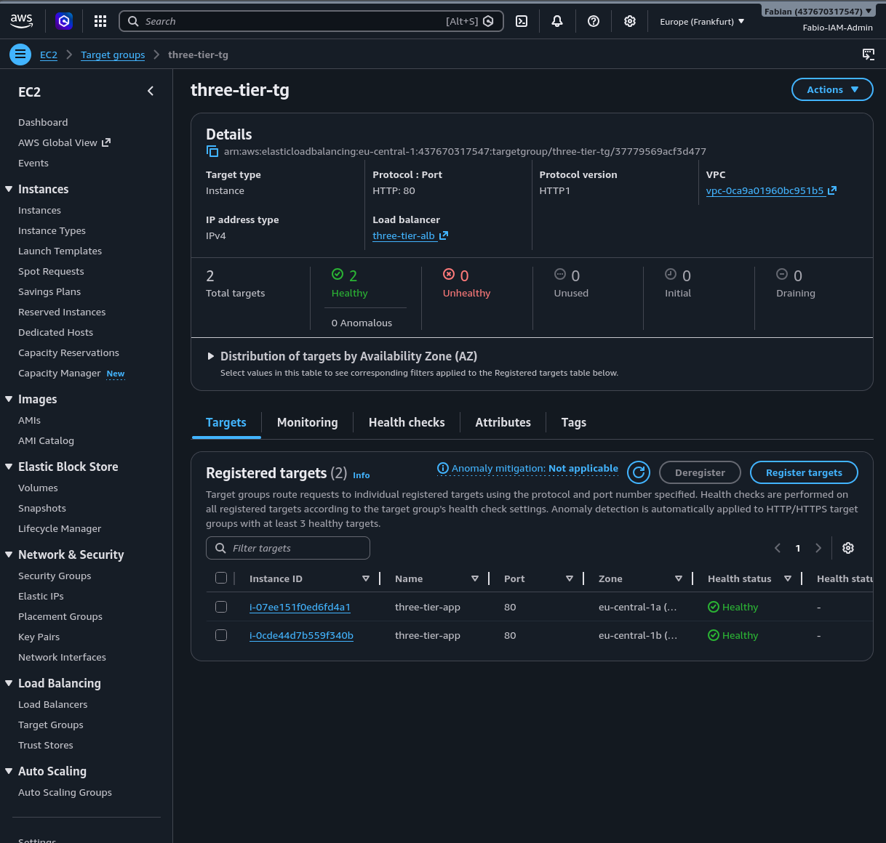

ALB status: **Active**. Internet-facing. Forwarding to target group on port 80.

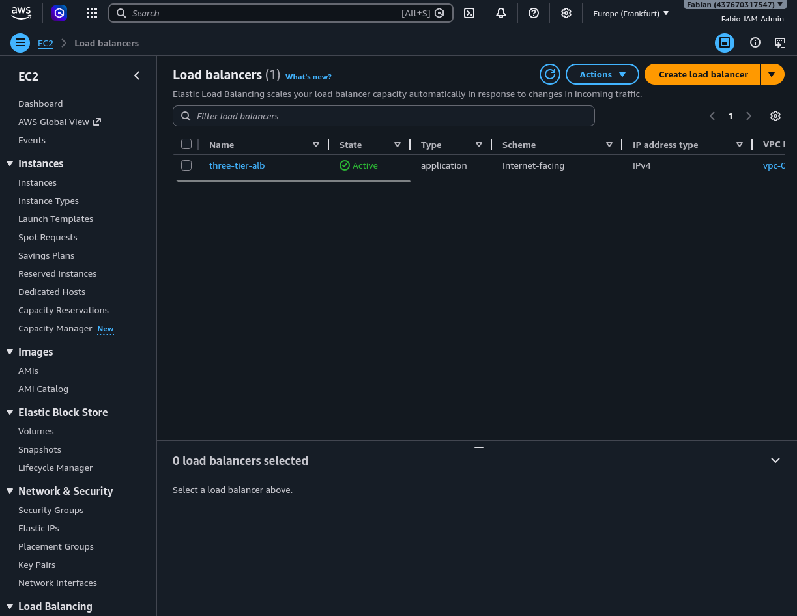

---

## Live application — load balancing proven

The app displays the internal hostname of whichever EC2 instance handled the request. Refreshing switches between AZs — proof the ALB is distributing traffic.

**Instance in AZ-a** (`10.0.11.x` subnet) — DB: Connected


**Instance in AZ-b** (`10.0.12.x` subnet) — DB: Connected

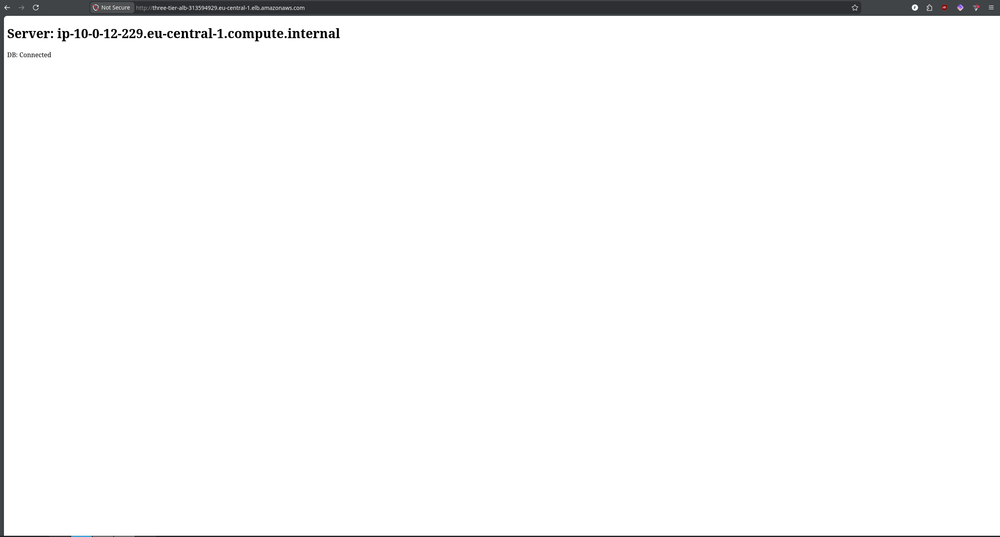

`DB: Connected` on both instances confirms the full chain: ALB → EC2 → RDS, all the way through the security group chain, with credentials injected via Terraform's `templatefile()` at boot time.

---

## CI/CD pipeline — all 7 steps green

Every push to `terraform/` triggers: format check → init → validate → plan. Runs in under 25 seconds. AWS credentials live in GitHub Secrets, never in code.

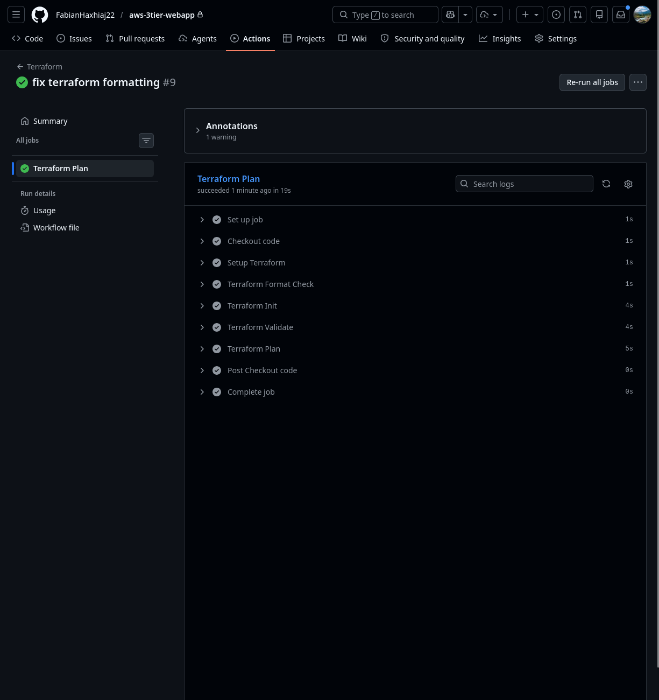

---

## Design decisions 

**Why a single NAT Gateway?** One per AZ would add ~$33/month and improve AZ fault tolerance, but is unnecessary for a demo. Toggled via variable.

**Why a bastion host instead of SSM?** To demonstrate classic SSH-based network access patterns. Production would use AWS Systems Manager Session Manager — no open ports, no key management.

**Why HTTP only?** HTTPS requires a registered domain and ACM certificate. Production would put CloudFront in front of the ALB with ACM for TLS termination.

**Why a shared private route table?** App and DB subnets need identical outbound routing through NAT. Separate tables would add cost with no benefit.

---

## Deploy your own

```bash
git clone https://github.com/FabianHaxhiaj22/aws-3tier-webapp.git
cd aws-3tier-webapp/terraform
cp terraform.tfvars.example terraform.tfvars
# fill in terraform.tfvars
terraform init
terraform apply
terraform output alb_dns_name
```

Tear it down when done:

```bash
terraform destroy
```

**Prerequisites:** AWS account · IAM user with AdministratorAccess · Terraform 1.x · AWS CLI v2 · SSH key at `~/.ssh/three-tier-key`

---

## Cost (eu-central-1)

| Resource | Monthly |
|---|---|
| NAT Gateway | ~$33 |
| ALB | ~$18 |
| 2× EC2 t3.micro | Free tier / ~$15 |
| RDS db.t3.micro | Free tier / ~$13 |
| Elastic IP | ~$4 |
| **Total** | **~$85** or **~$4** on free tier |

Run `terraform destroy` between demos.

---

## What I actually learned building this

The biggest surprise was how much of cloud networking comes down to two separate concepts that beginners often confuse: route tables decide where traffic *can* flow, and security groups decide whether it's *allowed* to. You can have a perfect route table and still have everything blocked, or perfect security groups and traffic going nowhere because the route doesn't exist.

The second thing that stuck was debugging the ALB health checks. When I first deployed, both instances came up but the target group kept showing them as unhealthy. The issue was that Apache hadn't finished starting before the first health check hit — I had to understand the EC2 boot sequence, cloud-init timing, and how the ALB's healthy threshold works before both instances showed green simultaneously.

Watching `terraform plan` show `18 to add, 0 to change, 0 to destroy` — and then seeing exactly those 18 resources appear in the AWS console one by one — made Infrastructure as Code finally click for me in a way that reading about it never did.

---

## What's next for this project

- [ ] CloudFront + ACM for HTTPS
- [ ] SSM Session Manager replacing the bastion host
- [ ] Terraform Cloud for remote state
- [ ] CloudWatch alarms + SNS for scaling events
- [ ] RDS Multi-AZ for production availability
- [ ] AWS WAF on the ALB
